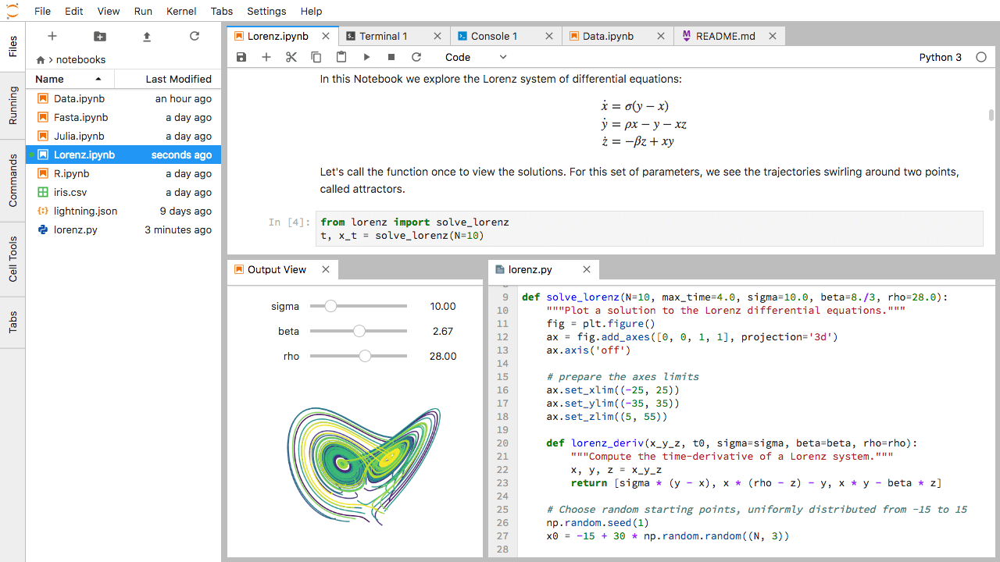
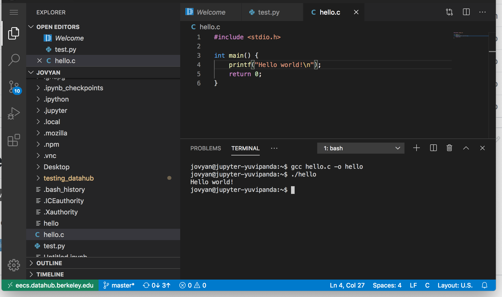

# Services Offered

This page lists the various services we offer as part of DataHub. Not all
these will be available on all hubs, but we can easily enable them as
you wish.

## User Interfaces

Our diverse user population has diverse needs, so we offer many different
user interfaces for instructors to choose from.

### Jupyter Notebook (Classic)

What many people mean when they say 'Jupyter', this familiar interface
is used by default for most of our introductory classes. Document oriented,
no-frills, and well known by a lot of people.

### RStudio

We want to provide first class support for teaching with R, which means
providing strong support for [RStudio](https://rstudio.com). This includes Shiny support.

Try without berkeley.edu account: 

Try with berkeley.edu account: [R DataHub](https://r.datahub.berkeley.edu)

### JupyterLab

[JupyterLab](https://github.com/jupyterlab/jupyterlab) is a more modern version of the classic Jupyter notebook from
the Jupyter project. It is more customizable and better supports some advanced
use cases. Many of our more advanced classes use this, and we might help
all classes move to this once there is a [simpler document oriented mode available](https://github.com/jupyterlab/jupyterlab/issues/8292)

### Linux Desktop (Experimental)

Sometimes, you just need to use something that requires a full desktop
environment to run. Instead of trying to get students to install things
locally, we offer a full fledged Linux Desktop environment they can
access from inside their browser! This is just a different 'UI' on the
same infrastructure as the notebook environment, so they all use the
same libraries and home directories.

Try without Berkeley.edu account: 

Try with Berkeley.edu account: [EECS DataHub](https://eecs.datahub.berkeley.edu/hub/user-redirect/desktop)

### Visual Studio Code (Experimental)

Sometimes you *just* want an IDE, not a notebook environment. We are experimenting
with a hosted, web version of the popular Visual Studio Code editor, to
see if it would be useful for teaching more traditional CS classes.

Try without Berkeley.edu account: 

Try with Berkeley.edu account: [EECS DataHub](https://eecs.datahub.berkeley.edu/hub/user-redirect/vscode/)

### SSH & SFTP (Experimental)

You can access the same environments and home directories via the terminal, using traditional `ssh` and `sftp` programs. See [here](ssh) for more documentation.

### More?

If you have a web based environment, we can almost certainly make it run under
a hub. Contact us and we'll see what we can do :)

## Services

Sometimes you need something custom to get your class going. Very
very interesting things can happen here, so we're always looking
for new services to add.

### Postgresql

Some of our classes require using real databases to teach. We
now experimentally offer a [postgresql](https://www.postgresql.org/)
server for each user on the [data100 hub](https://data100.datahub.berkeley.edu).

The data does not persist right now, but we can turn that on whenever
needed.

## Programming languages

We support the usual suspects - Python, R & Julia. However, there are no limits
to what languages we can actually support, so if you are planning on using
a different (open source) programming language, contact us and we'll set you
up.

## More?

We want to find solution to your interesting problems, so please bring us
your interesting problems 😁
